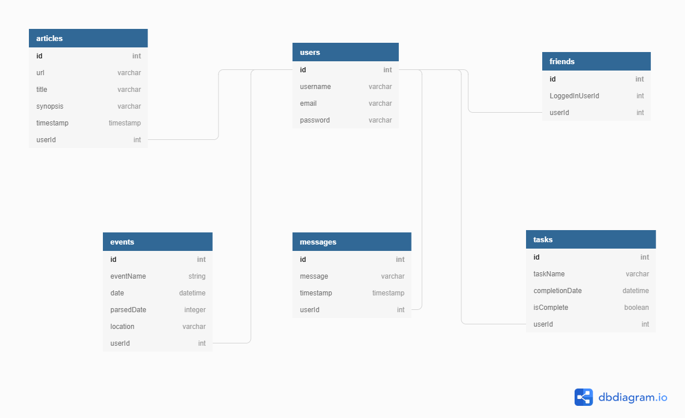

# Nutshell: The Information Dashboard

## Setup: Follow these steps to set up the app

1. Clone this repository
2. `cd` into the directory it creates
3. Make a `database.json` file in the `api` directory. Refer to ERD relationships below for data structure
4. Initiate the json server in port 5002 from the `api` directory.
    * `json-server -p 5002 -w database.json`
4. In a new terminal tab/window `cd` into the `src` directory
5. Run `npm start`

## ERD Relationships

## Using the App

Nutshell is a dashboard for people to use to organize their daily tasks, events, news article, and chat messages.

### Login and Register
Users can register by clicking "Register" on the login page. They can then use their registered email to login to the app.

### Messaging
A user can send a public message by typing into the 'Messages' text area and then clicking on the 'Submit' button. Once a message has been created the user can edit their by clicking the appropriate button. All messages from all users should be displayed

### Events

A user can record upcoming events by clicking the "New Event" button and filling out the appropriate input fields. Once save is clicked the events are sorted in chronological order with the most upcoming event being the first in the list. That most upcoming entry is also highlighted with an individual background color, bold font and increased font size for readability. The user also has the option to edit their event by clicking on the accompanied event button and editing the prefilled fields. The user also has the option to delete their event entirely. 

### News Articles

A user can save news articles to their personal dashboard by clicking 'Add Article' and inputting the appropriate information in the input fields. Saved articles are populated with the most recently saved/edited article first. Any article entry can be edited or deleted by clicking the 'edit' or 'delete' button below each saved article.

### Tasks

A user can save tasks to a to-do list by clicking "Add A New Task" and adding a description and an expected completion date to the respective forms that appear. Users have the ability to edit the name and date of tasks by clicking an "Edit" button located next to each task. They also can check a task as complete by clicking the "Complete" checkbox. This will remove the task from their to-do list, but it will still persist in the database as a completed task. 